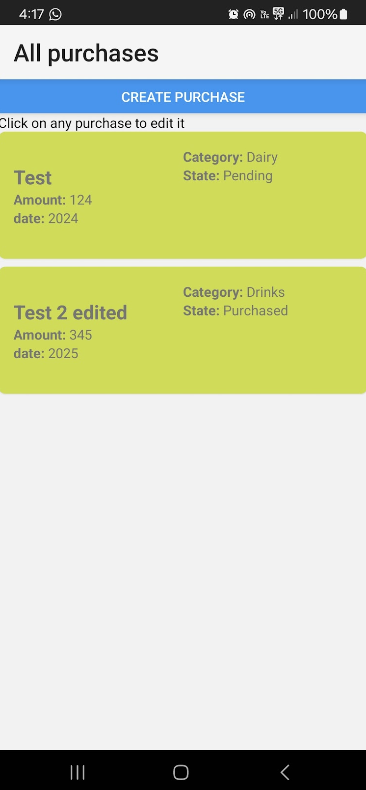
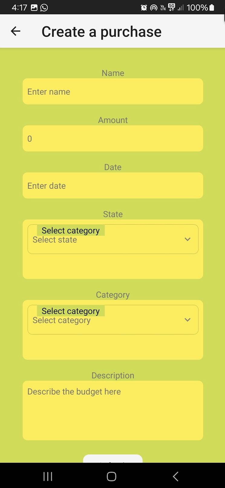
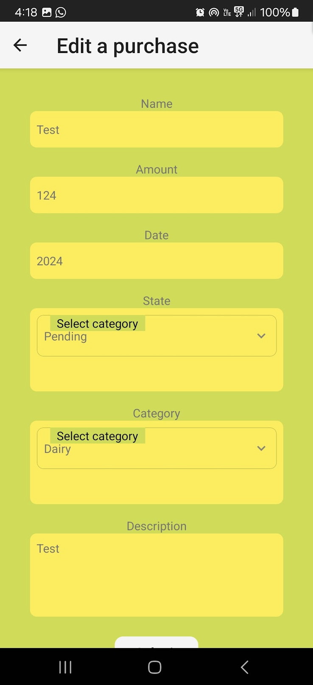

This is a new [**React Native**](https://reactnative.dev) project, bootstrapped using [`@react-native-community/cli`](https://github.com/react-native-community/cli).

# Getting Started for starting up SmartBuy with node

> **Note**: Make sure you have completed the [React Native - Environment Setup](https://reactnative.dev/docs/environment-setup) instructions till "Creating a new application" step, before proceeding.

## Step 1: Start the Metro Server

First, you will need to start **Metro**, the JavaScript _bundler_ that ships _with_ React Native.

To start Metro, run the following command from the _root_ of your React Native project:

```bash
# using npm
npm start

# OR using Yarn
yarn start
```

## Step 2: Start your Application

Let Metro Bundler run in its _own_ terminal. Open a _new_ terminal from the _root_ of your React Native project. Run the following command to start your _Android_ or _iOS_ app:

### For Android

```bash
# using npm
npm run android

# OR using Yarn
yarn android
```

### For iOS

```bash
# using npm
npm run ios

# OR using Yarn
yarn ios
```

If everything is set up _correctly_, you should see your new app running in your _Android Emulator_ or _iOS Simulator_ shortly provided you have set up your emulator/simulator correctly.

This is one way to run your app — you can also run it directly from within Android Studio and Xcode respectively.

## Congratulations! :tada:

You've successfully run and modified your React Native App. :partying_face:

# User manual of SmartBuy

SmartBuy allows you to take note of your Purchases and keep track of your expenses, allowing to see some statistics of your financial behavior. The information is stored exclusively in your phone allowing more privacy.

Next, a tutorial of the application is presented

## 1: All purchases screen

Here you can visualize all the purchases you have saved in your phone with their details.

At the top, you can see a button to create a new purchase



## 2: Create purchase screen

This button will take you to a form to create a purchase, providing all the relevant pieces of information. When you hit submit, the purchase is created and the user is taken back to the main screen in which will be able to see the new purchase.



## 2: Edit purchase screen

Back to the all purchases page, If you tap on any of the purchases, it will take you to a form in which you can edit the information of the purchase. The data of the purchase you are editing is preloaded in the form so you can know what are the actual values. When you hit submit, the purchase is updated.


